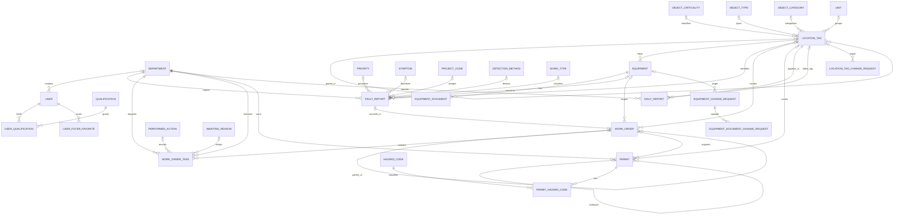
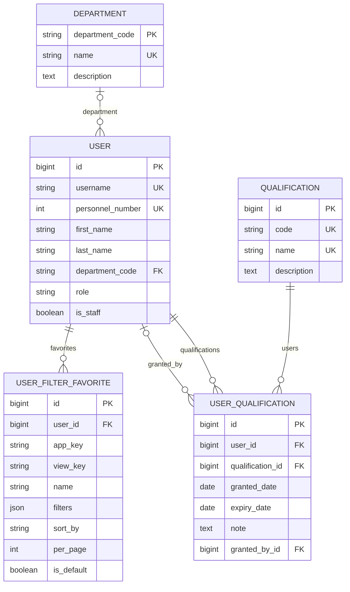
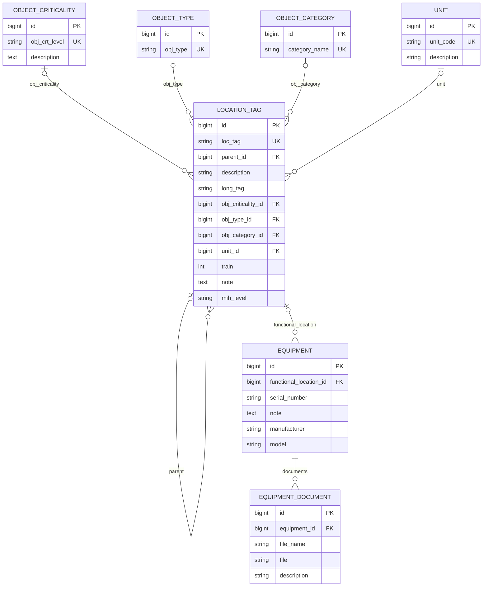
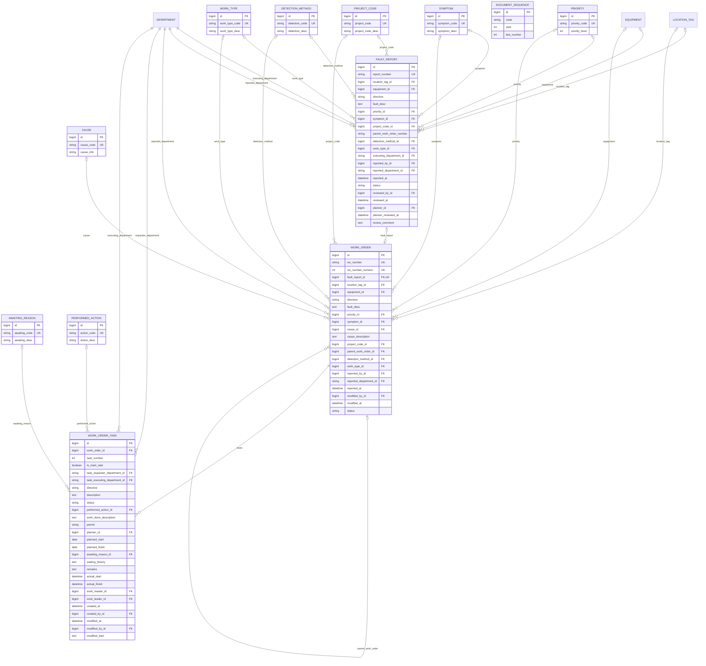
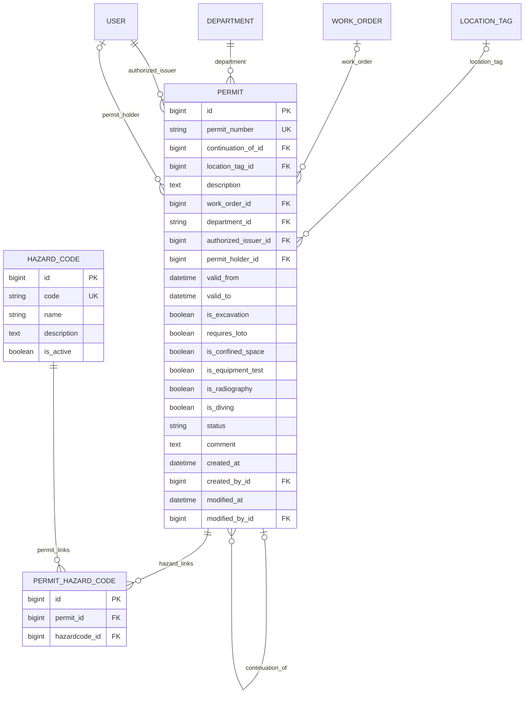
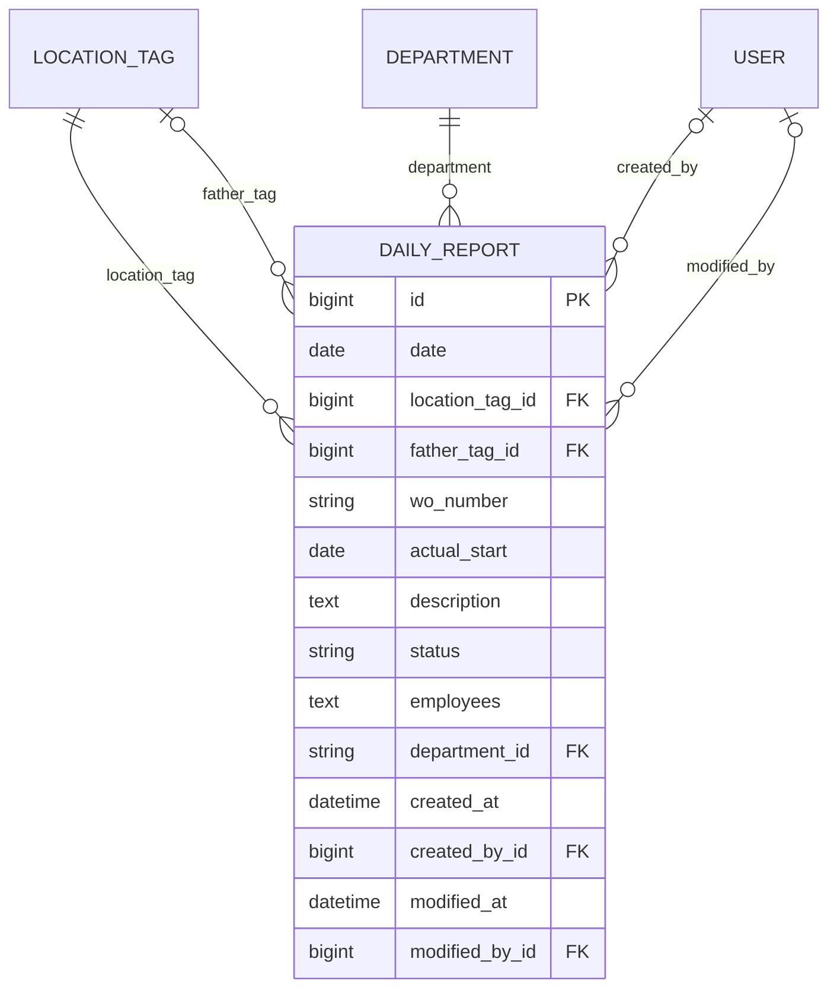
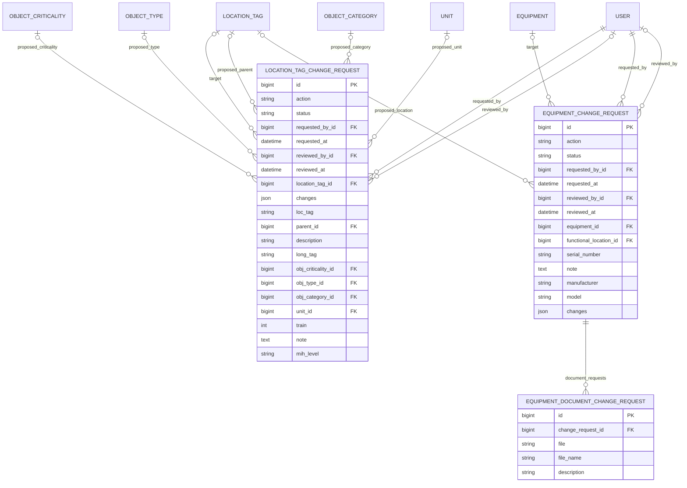

# CMMS Entity Relationship Diagram

This ERD is derived from the current Django model definitions in:

- `accounts/models.py`
- `daily_reports/models.py`
- `equipment/models/*.py`
- `permits/models/*.py`
- `work_orders/models/*.py`

The diagrams focus on application-owned business tables. Django framework tables,
automatically generated `django-simple-history` tables, and commented-out models are
not included.

## Conventions

- `PK` = primary key
- `FK` = foreign key
- `UK` = unique key
- A field ending in `_id` represents Django's database column for a relation.
- `TimeStampedModel` children also contain `created_at`, `created_by_id`,
  `modified_at`, `modified_by_id`, and `is_active`.
- `AuditHistoryModel` children also contain `created_date`, `created_by_id`,
  `modified_date`, `modified_by_id`, and `is_active`.
- Audit-user relationship lines are omitted from the diagrams to keep the core
  business relationships readable.

## System Overview

## Accounts

`USER_QUALIFICATION` is unique on `(user_id, qualification_id)`.
`USER_FILTER_FAVORITE` is unique on `(user_id, app_key, view_key, name)`, with
at most one default favorite per user and view.

## Equipment Registry

## Faults And Work Orders

`DOCUMENT_SEQUENCE` is used transactionally to generate fault-report and
work-order numbers, but there is no database foreign key from either document
table to the sequence table. `WORK_ORDER_TASK` is unique on
`(work_order_id, task_number)`.

The `WORK_ORDER_TASK.permit` field is currently plain text. It is **not** a
foreign key to the `PERMIT` table.

## Permits

`PERMIT_HAZARD_CODE` represents Django's automatically created join table for
the `Permit.hazard_codes` many-to-many field.

## Daily Reports

`DAILY_REPORT.wo_number` is currently plain text and does not enforce a foreign
key to `WORK_ORDER`.

## Equipment Change Requests

## Model Notes

- `LocationTag` forms a self-referencing hierarchy through `parent_id`.
- A `FaultReport` can be converted to at most one `WorkOrder`.
- A `WorkOrder` may contain many tasks and may have child work orders.
- A `Permit` may continue an earlier permit and may reference a work order,
  a location tag, or both.
- Equipment and location-tag change requests store proposed values separately
  from the target records and apply them only after approval.
- `maintenance/models.py` and `website/models.py` currently define no persisted
  application models.
