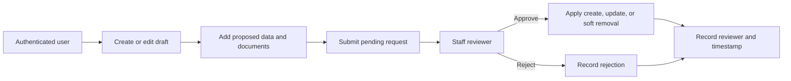
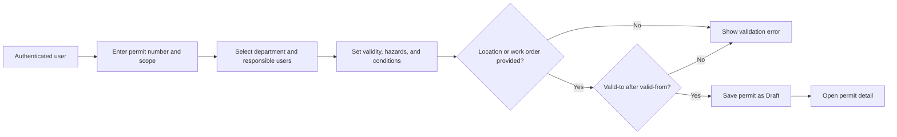
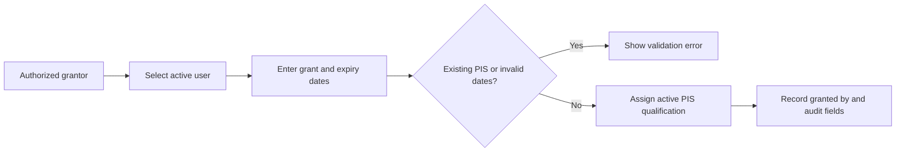

# Product Requirements Document

## Accounts, Equipment, and Permits

| Item | Value |
|---|---|
| Product | CMMS Software |
| Document type | Product Requirements Document |
| Scope | `accounts`, `equipment`, and `permits` applications |
| Version | 1.0 |
| Date | July 24, 2026 |
| Status | Current-state aligned draft |

## 1. Product Summary

The product provides controlled access to a computerized maintenance management
system, maintains the organization's functional-location and equipment registry,
and manages operational work permits.

The three applications covered by this PRD work together:

- **Accounts** identifies users, departments, roles, and qualifications.
- **Equipment** maintains location tags, installed equipment, documents, and
  approval-based asset changes.
- **Permits** records permits, hazards, validity periods, responsible people,
  special work conditions, and Permit Issuer System (PIS) qualifications.

This document describes the intended product behavior based on the current
Django models, views, forms, APIs, and administration interfaces.

## 2. Problem Statement

Maintenance and operations teams need a reliable way to:

- Know who is using the system and what authority they have.
- Maintain a trustworthy hierarchy of locations and installed equipment.
- Prevent uncontrolled changes to asset master data.
- Find equipment and location information quickly.
- Create and retrieve permits linked to the correct location and responsible
  personnel.
- Confirm that users performing permit-related duties hold the required
  qualification.
- Preserve accountability through audit fields, request histories, and
  approval records.

Without these controls, asset data becomes inconsistent, permit information is
hard to trace, and users may perform actions outside their authority.

## 3. Goals

### 3.1 Product Goals

1. Provide secure user authentication and role-aware access.
2. Maintain a searchable and auditable asset hierarchy.
3. Route equipment and location-tag changes through an approval workflow.
4. Support permit creation, discovery, reporting, and qualification management.
5. Preserve historical and user-attributed records for important changes.
6. Provide efficient list filtering, sorting, pagination, and CSV export.

### 3.2 Success Measures

- At least 95% of equipment and location-tag changes are completed through an
  attributable change request.
- Duplicate pending requests for the same asset remain below 1%.
- At least 90% of permit searches return the intended permit on the first query.
- All approved or rejected asset requests identify both requester and reviewer.
- No active PIS qualification has an expiry date earlier than its grant date.
- All permits contain a location tag, work order, or both.

## 4. Non-Goals

The following are outside this PRD:

- Work-order planning, execution, and closeout.
- Fault-report management.
- Daily reports.
- Inventory, spare parts, tools, labor booking, or procurement.
- Preventive-maintenance scheduling.
- Isolation execution beyond recording whether a permit requires LOTO.
- A full permit workflow engine unless specifically added to the requirements
  in a later release.

Work orders are referenced only where the permit application integrates with
them.

## 5. Users and Roles

### 5.1 User Types

| User type | Description |
|---|---|
| Authenticated user | Active system user who can view data and submit permitted requests. |
| Technician | Operational user with the `technician` account role. |
| Engineer | Engineering user with the `engineer` account role. |
| Supervisor | Supervisory user with the `supervisor` account role. |
| Staff reviewer | User with Django `is_staff` access who reviews equipment and location-tag requests. |
| Permit Office supervisor | Active supervisor assigned to the Permit Office department who may grant PIS qualifications. |
| Superuser | System administrator with unrestricted administrative authority. |

### 5.2 Permission Matrix

| Capability | Authenticated user | Staff reviewer | Permit Office supervisor | Superuser |
|---|---:|---:|---:|---:|
| View locations and equipment | Yes | Yes | Yes | Yes |
| Export locations and equipment | Yes | Yes | Yes | Yes |
| Submit asset create/update/remove request | Yes | Yes | Yes | Yes |
| Review asset requests | No | Yes | No, unless staff | Yes |
| Bulk approve or reject asset requests | No | Yes | No, unless staff | Yes |
| View permits | Yes | Yes | Yes | Yes |
| Create draft permits | Yes | Yes | Yes | Yes |
| Export permits | Yes | Yes | Yes | Yes |
| View PIS qualifications | Yes | Yes | Yes | Yes |
| Grant PIS qualification | No | Yes | Yes | Yes |
| Manage users and master data in admin | No | According to admin permissions | According to admin permissions | Yes |

## 6. Accounts Requirements

### 6.1 Authentication

**ACC-001 — Login**

- The system shall allow registered users to authenticate with username and
  password.
- An already authenticated user visiting the login page shall be redirected to
  the dashboard.
- Inactive users shall not be allowed to authenticate.

**ACC-002 — Logout**

- The system shall allow authenticated users to log out.
- After logout, the user shall be redirected to the login page.

**ACC-003 — Protected application pages**

- Equipment, permit, qualification, and dashboard pages shall require
  authentication unless explicitly documented as public.
- Unauthorized requests shall be redirected to login or return an appropriate
  API authentication response.

### 6.2 User Accounts

**ACC-004 — User identity**

Each user shall have:

- Unique username.
- Unique personnel number.
- First name and last name.
- Optional department.
- Role of technician, engineer, or supervisor.
- Active, staff, and superuser flags.

**ACC-005 — User administration**

- Authorized administrators shall be able to create, update, activate, and
  deactivate users.
- Administrators shall be able to assign department, role, groups, and explicit
  permissions.
- Passwords shall be stored using Django's password hashing system.

**ACC-006 — User lookup**

- Authenticated users shall be able to search active users by personnel-number
  prefix.
- Results shall show personnel number and full name, with username as fallback.
- Autocomplete results shall be limited to a practical maximum.

### 6.3 Departments

**ACC-007 — Department master data**

- A department shall have a unique department code and unique name.
- Departments may include a description and active status.
- Departments shall be available for assignment to users, permits, and related
  application records.

### 6.4 Qualifications

**ACC-008 — Qualification master data**

- A qualification shall have a unique code and unique name.
- Qualifications may include a description and active status.

**ACC-009 — User qualifications**

- A user may hold multiple qualifications.
- A qualification may be held by multiple users.
- The same qualification shall not be assigned to the same user more than once.
- A qualification assignment may record grant date, expiry date, note, and
  granting user.
- Expiry date shall not be earlier than grant date.

### 6.5 Dashboard

**ACC-010 — User dashboard**

- Authenticated users shall have access to a dashboard.
- Staff and superusers shall see pending location-tag and equipment requests.
- The dashboard shall display the total number of pending asset requests.
- Request lists shall prioritize the newest requests.

**ACC-011 — Pending-request indicator**

- Staff users shall see a global count of pending equipment and location-tag
  requests.
- Non-staff users shall not see a reviewer pending count.

### 6.6 Saved Filters

**ACC-012 — Filter favorites**

- A user shall be able to save named filter configurations for supported lists.
- A saved configuration may include filters, sort order, page size, and default
  status.
- Saved favorites shall be private to their owner.
- A user shall have no more than five favorites for the same application view.
- Favorite names shall be unique for each user and view.
- Only one favorite may be the default for a user and view.

### 6.7 Account Auditability

**ACC-013 — Audit fields**

- Department, qualification, and user-qualification records shall retain
  created date, created by, modified date, modified by, and active status.
- Administrative changes shall attribute the acting administrator.

## 7. Equipment Requirements

### 7.1 Equipment Master Data

**EQP-001 — Classification records**

The system shall maintain:

- Object criticality levels.
- Object types.
- Object categories.
- Units.

Each classification record shall support active status and audit information.
Codes or names identified as unique by the data model shall not be duplicated.

### 7.2 Location Tags

**EQP-002 — Location hierarchy**

- A location tag shall have a unique tag code.
- A location tag may reference another location tag as its parent.
- The hierarchy shall support parent and child navigation.
- A location tag may reference unit, train, criticality, object type, and object
  category.
- A location tag may store long tag, description, note, and MIH level.

**EQP-003 — Location list**

- Authenticated users shall be able to list location tags.
- The default list shall show active records.
- Users shall be able to filter by location tag, parent, unit, train,
  criticality, object type, object category, and active status.
- Users shall be able to sort by supported location and audit fields.
- Users shall be able to select a page size between 10 and 200 records.

**EQP-004 — Location detail**

- The location detail shall show classification data, parent, children,
  installed equipment, equipment documents, and audit information.
- The detail shall show recent historical changes.
- The detail shall show the latest change requests and whether a request is
  currently pending.

**EQP-005 — Location export**

- Authenticated users shall be able to export filtered location-tag data to CSV.
- Exported data shall include classification, hierarchy, status, and audit
  fields.

### 7.3 Equipment

**EQP-006 — Equipment record**

- Equipment may be installed at one functional location.
- Equipment may record serial number, manufacturer, model, and notes.
- Equipment shall include active status and audit information.

**EQP-007 — Equipment list**

- Authenticated users shall be able to list equipment.
- The default list shall show active equipment.
- Users shall be able to filter by functional location, serial number,
  manufacturer, model, note, and active status.
- Users shall be able to sort by supported equipment and audit fields.
- Users shall be able to select a page size between 10 and 200 records.

**EQP-008 — Equipment detail**

- The equipment detail shall show the functional location, identifying
  attributes, attached documents, and audit information.
- The detail shall show recent change requests and whether a pending request
  exists.

**EQP-009 — Equipment export**

- Authenticated users shall be able to export filtered equipment data to CSV.
- Exported data shall include functional location, unit, equipment attributes,
  status, and audit fields.

### 7.4 Equipment Documents

**EQP-010 — Equipment documents**

- Equipment may have multiple documents.
- A document shall store the uploaded file, display name, and optional
  description.
- Documents created through a change request shall not become equipment
  documents until the request is approved.
- Removing a draft document shall remove its stored file.

### 7.5 Change Requests

**EQP-011 — Change-request actions**

- Authenticated users shall be able to request creation, update, or removal of
  a location tag or equipment record.
- Requests shall record requester, request time, action, status, proposed data,
  and changed values.

**EQP-012 — Change-request statuses**

Supported statuses shall be:

- Draft.
- Pending.
- Approved.
- Approved with change.
- Rejected.

**EQP-013 — Draft equipment requests**

- Equipment create and update flows may create a draft request before final
  submission.
- The requesting user shall be able to upload and remove documents while the
  request is in draft.
- The requesting user shall be able to cancel or abandon their draft.
- Draft documents shall be deleted when the draft is cancelled.

**EQP-014 — Pending-request protection**

- A new pending update or removal request shall not be accepted when the same
  target already has a pending request.
- Location-tag codes shall remain unique when creating or renaming a tag.
- The system shall distinguish a requester's draft from another user's draft.

**EQP-015 — Review authorization**

- Only staff or superusers shall review asset change requests.
- A reviewer may inspect and edit proposed values before making a decision.
- The system shall record reviewer and review timestamp.

**EQP-016 — Approval**

- Approval of a create request shall create the target record.
- Approval of an update request shall apply the proposed values to the target.
- Approval of a removal request shall perform a soft removal by setting the
  target record inactive.
- Approved equipment requests shall copy staged documents to the approved
  equipment.
- Application of a request and update of its status shall be transactional.

**EQP-017 — Rejection**

- Only pending requests may be rejected.
- Rejection shall not modify the target asset record.
- The system shall record the rejecting user and timestamp.

**EQP-018 — Bulk review**

- Staff and superusers shall be able to approve or reject multiple pending
  asset requests.
- Each request shall be processed independently and failures shall be reported
  without hiding successful actions.

### 7.6 Equipment API

**EQP-019 — Location-tag API**

- Authenticated API clients shall be able to list and retrieve location tags.
- The API shall support pagination, search, filtering, and ordering.
- Read operations shall be available to authenticated users.
- Direct API writes shall require staff authority.
- Create and update operations shall record the acting user in audit fields.
- Location-tag codes created through the API shall be normalized to uppercase.

### 7.7 Equipment Auditability

**EQP-020 — Asset history**

- Location tags, equipment, equipment documents, and classification records
  shall retain created, modified, active, and historical information.
- Asset requests shall retain proposed values and request decisions.

## 8. Permit Requirements

### 8.1 Permit Record

**PER-001 — Permit identity**

- A permit shall have a required unique permit number.
- Permit numbers shall be trimmed before validation and storage.

**PER-002 — Permit scope**

- A permit shall reference a location tag, work order, or both.
- If a work order is selected without a location tag, the location shall be
  derived from the work order when available.
- A permit shall identify its responsible department.

**PER-003 — Permit people**

- A permit shall identify an authorized issuer.
- A permit may identify a permit holder.
- User-selection controls shall use authenticated user lookup services.

**PER-004 — Permit validity**

- A permit shall have valid-from and valid-to timestamps.
- Valid-to shall be later than valid-from.
- A permit shall be currently valid only when its status is active and the
  current time falls within its validity period.
- Date and time behavior shall use the application timezone.

**PER-005 — Hazards and special conditions**

- A permit may contain multiple hazard codes.
- Hazard codes shall contain code, name, description, active status, and audit
  information.
- A permit shall support flags for excavation, LOTO, confined space, equipment
  test, radiography, and diving.
- The permit detail shall present a readable summary of selected special
  conditions.

**PER-006 — Permit continuation**

- A permit may continue a previous permit.
- The previous permit shall expose its continuations.
- Selecting a previous permit may prefill description, department, location,
  work order, and special-condition flags.
- The new permit shall retain its own unique permit number and validity period.

### 8.2 Permit Lifecycle

**PER-007 — Permit statuses**

The data model shall support:

- Draft.
- Pending department approval.
- Pending safety review.
- Pending permit-office review.
- Isolation required.
- Isolations in progress.
- Ready for issue.
- Validated.
- Active.
- Suspended.
- Expired.
- Closed.
- Cancelled.

**PER-008 — Permit creation**

- Authenticated users shall be able to create a permit.
- New permits created through the standard form shall begin in draft status.
- Created-by and modified-by shall be set to the submitting user.
- Hazard selections shall be saved with the permit.

**PER-009 — Permit transitions**

- Status changes shall follow an explicitly defined transition matrix.
- Unauthorized users shall not be able to move a permit between controlled
  workflow states.
- Every transition shall record actor, timestamp, and optional comment.
- Activation shall require a valid time range and all mandatory approvals.
- Expired permits shall not be represented as currently valid.

### 8.3 Permit Discovery

**PER-010 — Permit list**

- Authenticated users shall be able to view a paginated permit list.
- The default view shall prioritize currently relevant permits.
- The list shall support quick search by permit number and work-order number.

**PER-011 — Permit filters**

The permit list shall support filtering by:

- Permit number and continued permit.
- Location tag, parent tag, unit, and train.
- Work order and department.
- Authorized issuer and permit holder.
- Status and hazard code.
- Validity, creation, and modification date ranges.
- Description and comment.
- Created-by and modified-by users.
- Each special-condition flag.
- Current validity.

**PER-012 — Permit sorting**

- Users shall be able to sort by permit identity, status, location, work order,
  department, hazard, validity, responsible people, special conditions, and
  audit fields.
- Invalid sort parameters shall fall back to a safe default.

**PER-013 — Permit filter favorites**

- Users shall be able to save, update, select, default, and delete permit-list
  filter favorites.
- Favorite ownership and limits shall follow `ACC-012`.

**PER-014 — Permit export**

- Authenticated users shall be able to export the filtered permit result set to
  CSV.
- CSV output shall use UTF-8 with a byte-order mark for spreadsheet
  compatibility.
- Export shall include permit identifiers, relationships, hazards, special
  conditions, validity, status, audit fields, and calculated current validity.

### 8.4 Permit Detail

**PER-015 — Permit detail**

- Authenticated users shall be able to open a permit by permit number.
- The detail shall show location, work order, department, people, hazards,
  validity, status, comments, special conditions, audit information, prior
  permit, and continuation permits.
- The detail shall clearly indicate whether the permit is currently valid.

### 8.5 PIS Qualifications

**PER-016 — PIS holder list**

- Authenticated users shall be able to view users holding the active `PIS`
  qualification.
- The list shall support pagination, filtering, and sorting.
- Filters shall include personnel number, department, grant-date range,
  expiry-date range, granting user, and active user status.

**PER-017 — Grant PIS qualification**

- PIS may be granted only by an active staff user or an active Permit Office
  supervisor.
- The system shall prevent duplicate PIS assignments to the same user.
- The grant shall record qualification, granting user, audit user, dates, and
  optional note.
- The workflow shall support saving and immediately adding another holder.

### 8.6 Permit Administration

**PER-018 — Permit administration**

- Authorized administrators shall be able to manage permits and hazard codes.
- Admin lists shall support search, filters, date hierarchy, and audit display.
- Admin changes shall attribute the acting administrator.

## 9. Core Workflows

### 9.1 Asset Change Workflow

### 9.2 Permit Creation Workflow

### 9.3 PIS Grant Workflow

## 10. Business Rules

1. Soft removal shall preserve equipment and location records by setting
   `is_active` to false.
2. A location tag code must be unique.
3. A department code and department name must be unique.
4. Usernames and personnel numbers must be unique.
5. Qualification codes and names must be unique.
6. A user may hold a given qualification only once.
7. Qualification expiry cannot precede its grant date.
8. A pending asset request may only be approved or rejected once.
9. A permit must have a location tag, work order, or both.
10. A permit's valid-to timestamp must be later than its valid-from timestamp.
11. A permit is currently valid only while active and within its validity
    interval.
12. Saved filter favorites are user-owned and limited per view.
13. Reviewer-only functions must be enforced server-side, not only hidden in
    templates.

## 11. Non-Functional Requirements

### 11.1 Security

- All state-changing browser requests shall use CSRF protection.
- Sensitive actions shall require authentication and server-side authorization.
- Create, update, remove, approve, and reject actions shall use POST, PATCH, or
  DELETE rather than GET.
- Uploaded equipment documents shall be validated for allowed size and file
  type.
- API responses shall not expose password values or sensitive authentication
  data.

### 11.2 Audit and Data Integrity

- Multi-record approvals shall use database transactions where partial updates
  would create inconsistent data.
- Audit actor fields shall be populated from the authenticated request.
- Historical records shall be retained for asset master-data changes.
- Foreign-key deletion behavior shall preserve operational records according to
  the model's protection rules.

### 11.3 Performance

- List pages shall paginate results and avoid loading unbounded datasets.
- Related objects used in lists and details shall use optimized database
  loading.
- Autocomplete endpoints shall return at most 10 results by default.
- CSV exports shall apply the same filters as the corresponding list.
- Frequently searched identifiers and statuses shall be indexed.

### 11.4 Usability

- Validation messages shall identify the field and corrective action.
- Lists shall preserve filters while sorting and paging.
- Detail pages shall show active status and pending-request state clearly.
- Forms using autocomplete shall reject typed values that were not selected
  from valid results.

### 11.5 Time and Localization

- Application timestamps shall be timezone-aware.
- The operational timezone shall be `Asia/Tehran`.
- CSV output and user-facing dates shall use consistent formats.

## 12. Acceptance Criteria

### 12.1 Accounts

- A valid active user can log in and reach the dashboard.
- An inactive user cannot log in.
- Staff see pending asset requests; regular users do not see reviewer controls.
- Duplicate username, personnel number, department, or qualification values are
  rejected.
- PIS grant permissions are enforced through direct URL access as well as the
  user interface.

### 12.2 Equipment

- A regular authenticated user can submit create, update, and remove requests.
- A regular user cannot approve or reject requests.
- A staff user can approve or reject a pending request.
- Approving creation produces one new target record.
- Approving update changes only the submitted or reviewer-adjusted values.
- Approving removal makes the target inactive without deleting it.
- Rejecting a request leaves the target unchanged.
- Approved equipment documents become accessible from the equipment detail.
- Filtered CSV results match the filters used on the corresponding list.

### 12.3 Permits

- Permit creation fails when both location and work order are empty.
- Permit creation fails when valid-to is not later than valid-from.
- Selecting a continuation permit returns the supported prefill values.
- A valid permit detail displays hazards, special conditions, continuations,
  audit data, and current validity.
- Permit filter favorites are visible only to their owner.
- Permit CSV export reflects active filters.
- Duplicate PIS assignment and invalid PIS dates are rejected.

## 13. Dependencies

- Django authentication, authorization, sessions, messages, and admin.
- Django REST Framework for account registration and location-tag API.
- `django-filter` for API filtering.
- `django-simple-history` for asset and master-data history.
- `django-import-export` for administrative location-tag import/export.
- Work-order records for optional permit linkage.
- Media storage for equipment documents.

## 14. Known Implementation Gaps

The following items should be resolved before treating this PRD as fully
implemented:

1. The permit model defines a complete status set, but the user-facing permit
   application currently provides creation, list, detail, and export rather
   than controlled lifecycle transitions.
2. Permit update, approval, activation, suspension, expiration, closure, and
   cancellation workflows are not exposed as complete application workflows.
3. The account registration API does not currently collect all required custom
   user fields and its success response does not align with the serializer
   output.
4. The permit continuation-data endpoint should explicitly require
   authentication.
5. Equipment and location remove requests are currently initiated through GET
   routes; state-changing operations should require POST.
6. Staff may directly modify location tags through the REST API, bypassing the
   standard change-request approval workflow.
7. Reviewer-edited requests do not consistently use the
   `approved_with_change` status.
8. Uploaded equipment request documents do not currently define explicit file
   size, extension, or content-type restrictions.
9. Bulk asset-review queries should explicitly restrict processing to pending
   requests.
10. Permit creation authorization is currently broad; the intended policy for
    who may create or progress permits should be confirmed.

## 15. Recommended Delivery Phases

### Phase 1 — Stabilize Existing Behavior

- Fix account registration.
- Protect all helper endpoints.
- Convert state-changing GET routes to POST.
- Add upload validation.
- Restrict bulk review to pending requests.
- Add automated permission and business-rule tests.

### Phase 2 — Complete Permit Workflow

- Define the permit transition matrix and role ownership.
- Add transition actions, comments, and transition audit records.
- Add expiration handling and activation validation.
- Add edit, suspend, close, and cancel interfaces.

### Phase 3 — Strengthen Governance

- Decide whether staff API writes must also use change requests.
- Apply `approved_with_change` when reviewers modify proposals.
- Add reporting for request turnaround time, rejected requests, inactive
  assets, expiring permits, and expiring PIS qualifications.
